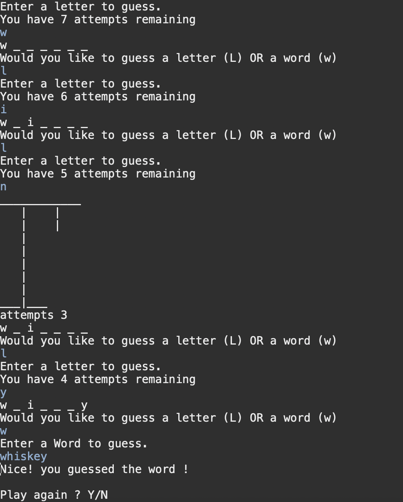

# Java Hangman CLI

## Image

## Setup

- To run the application, A Java compiler is required. Run the Main.java file to begin.

## Description of project (spec / MVP)

- A Java CLI implementation of the Hangman word game. A User is given a word at random (From a library of words stored in a text file) and the aim of the game is
  to guess the word, in 7 tries or less. The player has the option to guess one letter at a time, or the whole word.
  If the player is unable to guess the word, the player loses.
- The purpose of this Project was to solidify and apply my knowledge of Java.

## Approach

- The program was my first project built using Java.
  - The project was a great opportunity to practice my Java skills and learn about building command-line applications.
  - Custom classes and methods were required to build the game, which helped my understanding when dabling with OOP principles.
  - A range of version control systems were required in order to keep the game running until the player decides to stop playing.
  - The user is prompted to play again after winning or losing the game.

## Reflection

- Overall, I enjoyed making this application as I was able to apply many concepts i was familiar with in JavaScript in Java. The syntax change and strict types definitely had a learning curve as it took time to get used to.
- I am proud of being able to read files from an external source other than consuming an API or fetching a resource. Using Scanners for user input and reading lines in a text file required some research but was extremley satisfying when implemented.
- One of the issues I faced was regarding the logic of the game itself. It required many conditional loops which got confusing, however i was able to create some methods, keeping the DRY principle in mind, to create modular, parameterized code which is easier to read and maintain.
- Some things I would do differently.
  - I would make my code more granular using more classes for word and letter guessing logic.

## Future Goals

- Add an option for the player to vs a computer.
- Scoreboard system

### Stay in touch

- Linkedin
  [LinkedIn](https://www.linkedin.com/in/paramsinghau/)

### Licence

